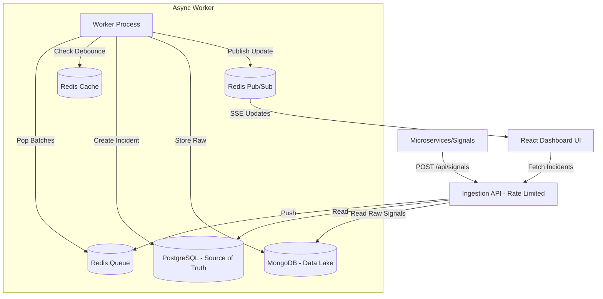

# Incident Management System (IMS)

A resilient Incident Management System designed to monitor a complex distributed stack, intelligently ingest signals, manage failure mediation workflows, and track incidents to resolution.

## Architecture Diagram



## System Components
1. **Backend**: Node.js + Express + TypeScript. Handles high-volume ingestion and APIs.
2. **Frontend**: React + Vite + TypeScript. Provides real-time dashboard.
3. **PostgreSQL**: Source of truth for Work Items and RCA records. Guarantees transactional state transitions.
4. **MongoDB**: Data Lake for storing high-volume raw error payloads.
5. **Redis**: Cache, Queue, and Pub/Sub mechanism.

## Handling Backpressure & High-Throughput
To handle bursts of up to 10,000 signals/sec without crashing the persistence layer (PostgreSQL/MongoDB):
1. **Rate Limiting**: `express-rate-limit` is applied to the ingestion API to prevent complete API exhaustion.
2. **Async Queue**: Signals are immediately pushed to a fast in-memory Redis List (`rPush`) and an HTTP `202 Accepted` is returned instantly. This unblocks the ingestion API.
3. **Batch Processing**: A background worker pulls signals from Redis in chunks (e.g., 500 at a time). This smooths out spikes and prevents overwhelming the databases.
4. **Debouncing Strategy**: Before writing to PostgreSQL, the worker checks a `debounce:${componentId}` key in Redis. If 100 signals arrive within 10 seconds for the same component, only ONE Work Item is created in Postgres, while all 100 are linked to that Work Item and dumped to MongoDB efficiently in bulk (`insertMany`).

## Setup Instructions

1. **Start the environment using Docker Compose**:
   ```bash
   docker-compose up -d --build
   ```
   This will spin up PostgreSQL, Redis, MongoDB, the Node.js Backend, and the React Frontend.

2. **Access the application**:
   - Frontend Dashboard: [http://localhost:3000](http://localhost:3000)
   - Backend API: `http://localhost:8080`

3. **Simulate a Failure Event**:
   To test the system's debouncing and ingestion, run the included script:
   ```bash
   npm install axios
   node sample_data.js
   ```
   This will simulate an RDBMS outage, followed by a Cache failure, triggering high-volume signals.

## Evaluation Criteria Highlights
- **Concurrency & Scaling**: In-memory Redis queue separates ingestion from persistence.
- **Data Handling**: Raw payloads go to MongoDB, structured state/RCA to Postgres.
- **Resilience**: Rate limiter and transactional state transitions on RCA submission.
- **UI/UX**: Glassmorphism design, real-time Server-Sent Events (SSE) updates, and structured RCA forms.
